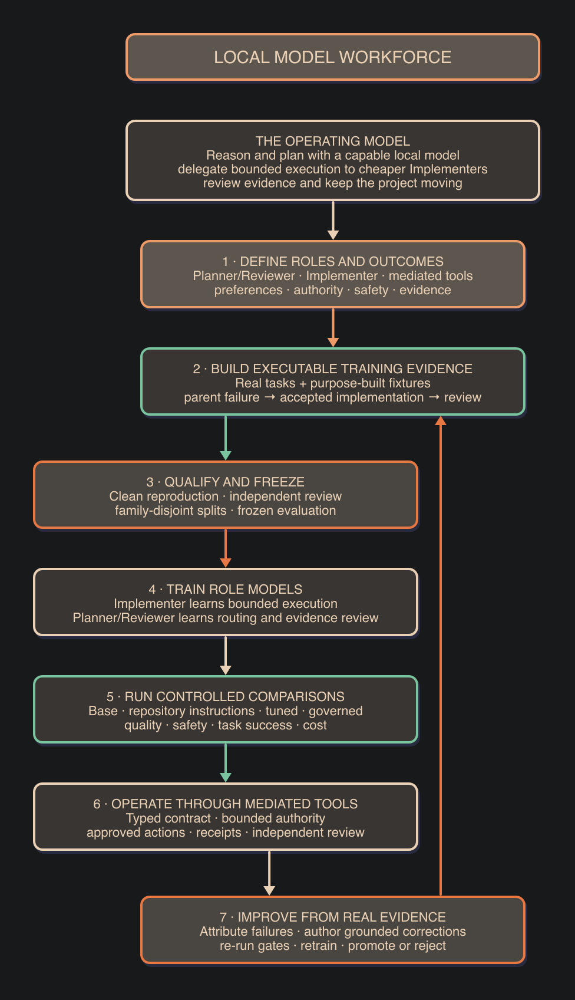

# Local Model Workforce

Local Model Workforce is an evidence-led design for local agentic software
work. It separates deliberate planning from bounded implementation and
independent review.

This is an author-maintained personal system and research record. The
repository does not accept external contributions.

1. A **Planner** agrees the outcome, scope, authority and acceptance criteria.
2. An **Implementer** executes a typed contract through approved tools.
3. Deterministic services enforce authority and return observed receipts.
4. A **Reviewer** checks the current artifacts and evidence.

The aim is to keep capable reasoning where it adds value and route repeatable
implementation to a cheaper local model. The system persists plans, changes,
tests and decisions outside conversation context.

## Status

This repository is a pre-release method and interface scaffold.

Available now:

- a concise architecture and evidence method;
- role-neutral dispatch, policy and receipt schemas;
- two editable process diagrams; and
- a release-tree privacy validator.

Not yet released:

- model weights or adapters;
- training or evaluation data;
- reproducible training results;
- a mediated MCP runtime; and
- performance or safety claims.

Planned work is labelled as planned. A documented design is not evidence that
the corresponding runtime or model exists.

## Public document set

Each document has one scope:

| Document | Authority |
|---|---|
| [Architecture and control layers](docs/architecture-and-controls.md) | Roles, routing, communication and enforcement boundaries |
| [Corpus, training and evaluation](docs/corpus-training-evaluation.md) | Evidence construction, model adaptation and qualification |
| [Flywheel and extensions](docs/flywheel-and-extensions.md) | Failure admission, red-team work and specialist modules |
| [Limitations and evidence status](docs/limitations-and-evidence.md) | Current claims, missing evidence and release conditions |

The README is the public index. The four documents do not override each other.
The first training recipe will be released with the completed reproducible
Implementer fine-tune and evaluation. Later recipes and result reports will be
added only with their runnable artifacts.

## Control principle

Repository instruction files are advisory. Fine-tuning teaches probabilistic
defaults. MCP tools, hooks, schemas and sandboxes enforce mandatory boundaries.
The system uses each layer for the problem it can solve.

## Licence

Project-authored source and documentation use
[AGPL-3.0-only](LICENSE). Models, datasets and third-party components retain
their own licences.
