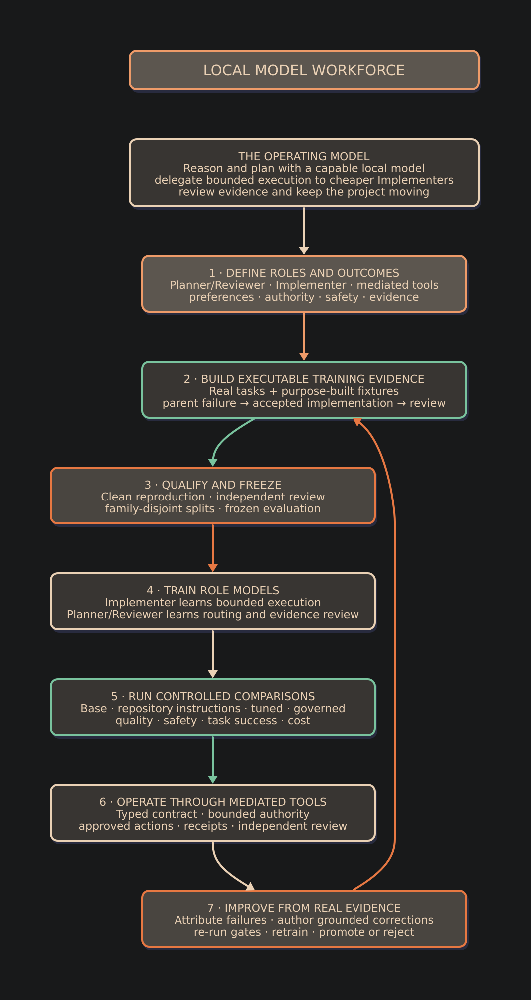

# Local Model Workforce

Local Model Workforce is an evidence-led design for local agentic software
work. It separates deliberate planning from bounded implementation and
independent review.

This is an author-maintained personal system and research record. The
repository does not accept external contributions.

1. A **Planner** agrees the outcome, scope, authority and acceptance criteria.
2. An **Implementer** executes a typed contract through approved tools.
3. Deterministic services enforce authority and return observed receipts.
4. A **Reviewer** checks the current artifacts and evidence.

The aim is to keep capable reasoning where it adds value and route repeatable
implementation to a cheaper local model. The system persists plans, changes,
tests and decisions outside conversation context.

## Current publication

The repository now includes the first public project evidence set:

- [Technical report](docs/publications/technical-report.html)
- [Project brief](docs/publications/project-brief.html)
- [Presentation](docs/publications/presentation.html)

The report documents the v7 task-bound Implementer fine-tuning experiment and
15 paired HumanEval+ runs. The fine-tune produced a strong role shift and retained
broad compact coding capability, with measured gains and losses by sub-task type.
The brief and presentation provide shorter views of the same evidence.

The publication does not include model weights, training data or a runnable
recipe. Those artifacts will follow only after repository reconciliation,
final evaluation, licence review and a reproducibility check. The planned
quantised model will be published on Hugging Face. The corresponding recipe
and scripts will be published here.

## Available now

- the architecture and evidence method;
- role-neutral dispatch, policy and receipt schemas;
- system diagrams;
- the report, brief and presentation.

## Not yet released

- model weights or adapters;
- training or evaluation data;
- the reproducibility recipe and scripts;
- a mediated MCP runtime; and
- an unrestricted production or safety claim.

Planned work is labelled as planned. A documented design is not evidence that
the corresponding runtime or model release exists.

## Public document set

| Document | Authority |
|---|---|
| [Architecture and control layers](docs/architecture-and-controls.md) | Roles, routing, communication and enforcement boundaries |
| [Corpus, training and evaluation](docs/corpus-training-evaluation.md) | Evidence construction, model adaptation and qualification |
| [Flywheel and extensions](docs/flywheel-and-extensions.md) | Evidence routing, failure admission and specialist modules |
| [Limitations and evidence status](docs/limitations-and-evidence.md) | Current evidence, boundaries and planned work |

The README is the public index. The documents do not override each other.

## Control principle

Repository instruction files are advisory. Fine-tuning teaches probabilistic
defaults. MCP tools, hooks, schemas and sandboxes enforce mandatory boundaries.
The system uses each layer for the problem it can solve.

## Licence

Project-authored source and documentation use
[AGPL-3.0-only](LICENSE). Models, datasets and third-party components retain
their own licences.
