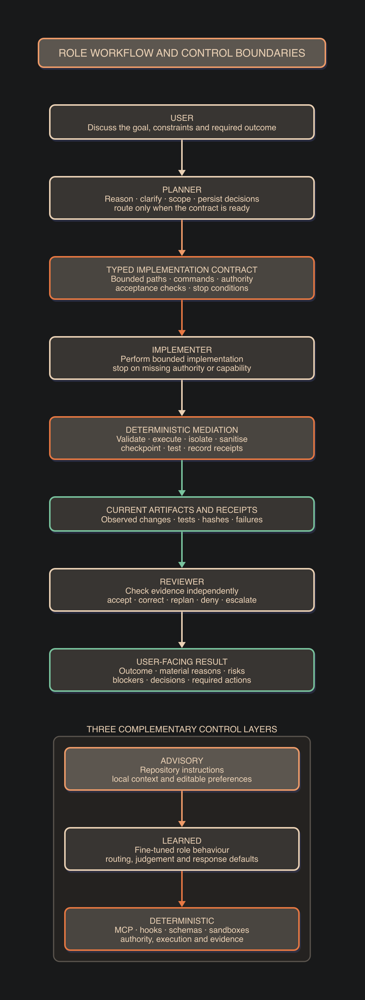

# Architecture and control layers

## Role workflow

The system uses portable roles instead of fixed model names.

[D2 source](diagrams/02_architecture_and_controls.d2) ·
[SVG](diagrams/02_architecture_and_controls.svg)

The Planner can answer directly, clarify the request, deny unsafe work or
record a missing capability. It dispatches only when the task has a declared
Implementer capability and an approved tool path.

The Implementer follows the contract. It does not increase scope, invent
authority or claim unobserved results.

The Reviewer checks current artifacts and fresh receipts. It accepts the work,
requests a focused correction, replans or escalates.

Planning and review can share a model or use separate models. Specialist
Implementers retain the same authority, evidence and return-state contracts.

## Three control layers

| Layer | Purpose | Limitation |
|---|---|---|
| Repository instruction files | Explain local context and editable preferences | Advisory; the model can miss or misinterpret them |
| Fine-tuned behaviour | Teach recurring judgement, routing and response defaults | Probabilistic and limited to trained coverage |
| Deterministic mediation | Enforce authority, schemas, execution and evidence | Requires explicit tools and more engineering |

Use a learned rule when the rule changes repeated judgement or response shape.
Use deterministic enforcement when noncompliance cannot be accepted. Some
requirements belong in both layers: the model learns to request the safe
operation, and the runtime rejects any unsafe alternative.

## Mediated runtime

Model output is untrusted input. A mediated runtime must control:

- repository read and write paths;
- approved command identifiers and arguments;
- package and environment changes;
- credentials, private data and untrusted tool output;
- external communication and irreversible actions;
- checkpoints, retries and idempotent recovery;
- test execution and Definition of Done;
- immutable receipts and evidence freshness; and
- cumulative outcomes across a sequence of actions.

An individually acceptable action can contribute to a prohibited outcome.
The runtime must retain constraints across the complete trajectory.

The mediated runtime is planned. It is not included in the current scaffold.

## Attention-aware communication

Complex work can require detailed analysis. The user does not need every
working detail at once.

The system separates:

- a durable work record with facts, evidence, assumptions, options, decisions,
  uncertainty, tests and receipts;
- a concise visible response that states the outcome, material reasons, risks,
  blockers and required action; and
- a disclosure response that retrieves more detail when requested.

ASD-STE100 principles guide the visible response. They do not limit reasoning,
technical artifacts, list length or necessary detail. A concise response must
not remove a material risk, blocker, decision or required action.

## Why reasoning remains important

Reasoning lets a model connect requirements, repository state, tools and
evidence across a task. Globally training the model to be brief could reduce
that capability. The design therefore constrains the user-facing projection,
not the model's full problem-solving capacity.
