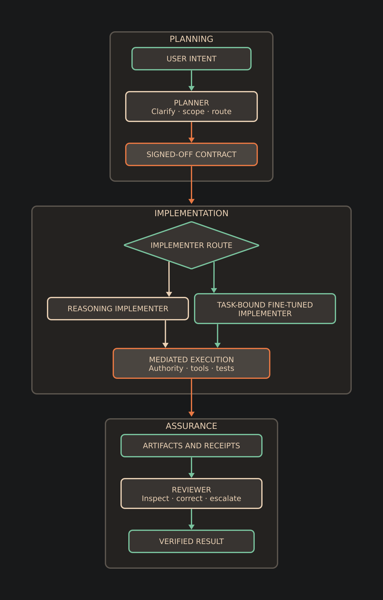

# Architecture and control layers

## Route before inference

The system routes work before a model starts. It selects the smallest suitable
model seat for the signed-off task.

[D2 source](diagrams/02_architecture_and_controls.d2) ·
[SVG](diagrams/02_architecture_and_controls.svg)

The Planner and Reviewer are distinct roles, even when one capable model can fill
both seats at different stages. The Planner clarifies the goal, approves scope and
routes the signed-off contract. The Reviewer independently checks the resulting
artifacts and receipts. A reasoning Implementer handles difficult specified work.
The task-bound fine-tuned Implementer handles clear, bounded changes.

Every Implementer acts through the same mediated execution layer. The contract
defines permitted paths, actions, tests, stop conditions and evidence. The
runtime executes approved actions and returns current receipts. Independent
review decides whether work can advance.

The [technical report](publications/technical-report.html) documents the v7
task-bound Implementer fine-tuning experiment. Correct role events increased from
0% to 90.70% on the common 86-task set, while fixture pass did not improve. The
mediated multi-role runtime remains planned.

## Three control layers

| Layer | Purpose | Limitation |
|---|---|---|
| Repository instruction files | Explain local context and editable preferences | Advisory; the model can miss or misinterpret them |
| Fine-tuned behaviour | Teach recurring judgement, routing and response defaults | Probabilistic and limited to trained coverage |
| Deterministic mediation | Enforce authority, schemas, execution and evidence | Requires explicit tools and more engineering |

Use a learned rule when the rule changes repeated judgement or response shape.
Use deterministic enforcement when noncompliance cannot be accepted. Some
requirements belong in both layers: the model learns to request the safe
operation, and the runtime rejects an unsafe alternative.

## Mediated runtime

A mediated runtime must control:

- repository read and write paths;
- approved command identifiers and arguments;
- package and environment changes;
- credentials, private data and untrusted tool output;
- external communication and irreversible actions;
- checkpoints, retries and idempotent recovery;
- test execution and acceptance criteria;
- immutable receipts and evidence freshness; and
- cumulative outcomes across a sequence of actions.

The mediated runtime is planned. It is not part of the current public release.

## Attention-aware communication

The system separates a complete durable work record from a concise visible
response. It can disclose more detail when the user requests it. ASD-STE100
principles guide visible prose. They do not remove a material risk, blocker,
decision or required action.
