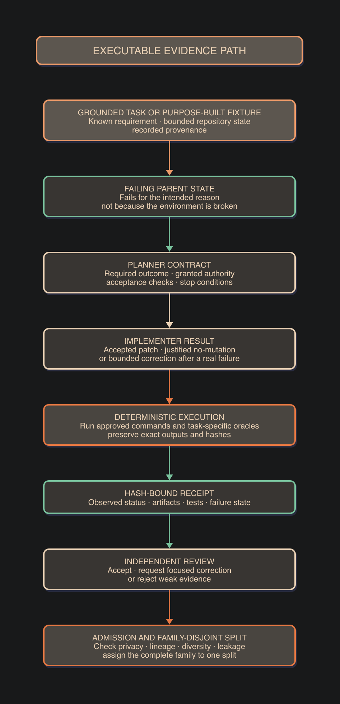

# Corpus, training and evaluation

## Executable evidence

The training unit is an executable causal family, not a prompt paraphrase.

[D2 source](diagrams/03_executable_evidence_path.d2) ·
[SVG](diagrams/03_executable_evidence_path.svg)

An implementation family needs:

- a parent revision that fails for the intended reason;
- an accepted change that passes a task-specific oracle;
- bounded paths, commands and authority;
- an observed implementation or no-mutation result;
- a correction path for a real failed receipt where applicable; and
- complete lineage from source to role projections.

Admission rejects fabricated completion, unexecuted patches, unsupported
authority, repeated patch or negative shapes, target leakage, stale evidence
and family overlap between splits.

Language is usually a carrier for tools and verification. The corpus should not
re-teach ordinary syntax unless a measured retention failure requires it.

## Role projection

One linked family produces separate role views:

- the Planner sees task state, available capabilities and authority;
- the Implementer sees the bounded contract and necessary repository context;
- the Reviewer sees the resulting artifacts and executed receipts.

No role receives information that reveals a hidden target. Whole families stay
in one train, validation or frozen-evaluation split.

## Training record

A reproducible training run binds:

- base model, revision and licence;
- tokenizer, serialization and chat template;
- dataset and split hashes;
- optimizer, precision and hyperparameters;
- container and toolchain revisions;
- checkpoint and resume behaviour;
- mounted and excluded data;
- launch authority; and
- evaluation thresholds.

Full fine-tuning and parameter-efficient adaptation use the same evidence
standard. Framework changes can alter serialization or execution. They must not
alter role semantics, family splits, accepted outcomes or evaluation oracles.

No training recipe or result is released in this scaffold.

## First recipe provenance

The first Implementer run uses the
[DGX Spark Unsloth Lossless Speedup](https://github.com/albond/DGX_Spark_Unsloth_Lossless_Speedup)
recipe as its upstream baseline.

The released derivative recipe must include:

- the upstream author, repository, licence and exact commit;
- the unmodified upstream procedure;
- a machine-readable list of local changes;
- the reason for each change;
- the changed files and their hashes;
- a comparison with the upstream baseline where applicable; and
- measured effects, failures and limitations.

Do not present an upstream capability as project-authored work. Do not hide a
local modification inside a copied recipe.

## Evaluation levels

1. **Implementer:** contract adherence, scope, tool selection, implementation
   quality, honest state and base-capability retention.
2. **Planner and Reviewer:** routing, clarification, contract quality, failure
   attribution, evidence use and independent review.
3. **Mediated system:** final task success, focused correction, unnecessary
   calls, latency, token cost, energy use and failure ownership.
4. **Communication:** fidelity between the durable record and the visible
   response.

Evaluation uses family-disjoint frozen tasks in isolated environments. It
scores the actual deliverable, not rubric recitation.

The primary comparison holds the task, tools and evaluator constant while
changing:

- the untouched base model;
- the fine-tuned model; and
- the complete mediated system.

An experiment can add a repository-instruction condition when it tests a
specific claim about advisory instructions. That condition is not part of the
normal operating workflow.

Results remain provisional until the harness, environment, inputs and result
manifests reproduce independently.
