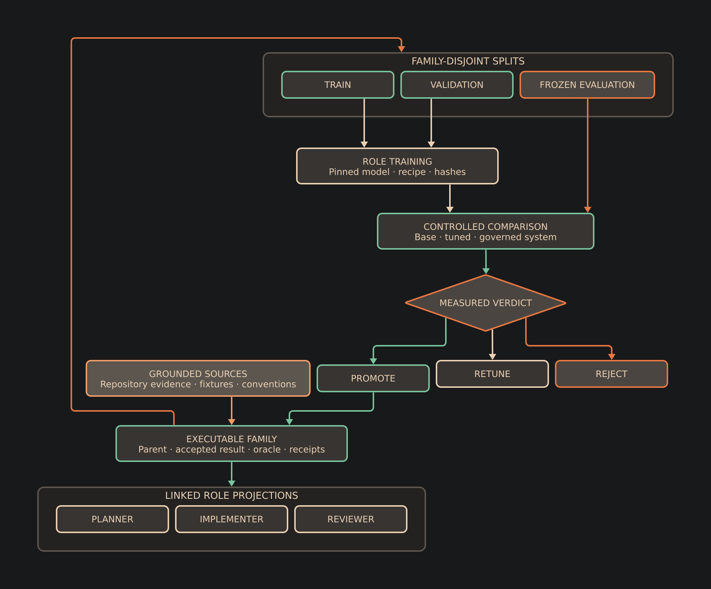

# Corpus, training and evaluation

## Executable evidence

The training unit is an executable causal family, not a prompt paraphrase.

[D2 source](diagrams/03_executable_evidence_path.d2) ·
[SVG](diagrams/03_executable_evidence_path.svg)

An implementation family needs:

- a parent revision that fails for the intended reason;
- an accepted change that passes a task-specific oracle;
- bounded paths, commands and authority;
- an observed implementation or no-mutation result;
- a correction path for a real failed receipt where applicable; and
- complete lineage from source to role projections.

Admission rejects fabricated completion, unexecuted patches, unsupported
authority, target leakage, stale evidence and family overlap between splits.

## Role projection

One linked family produces separate role views. The Planner sees task state and
authority. The Implementer sees the bounded contract and necessary repository
context. The Reviewer sees current artifacts and executed receipts. Whole
families stay in one train, validation or frozen-evaluation split.

## Current experiment record

The [technical report](publications/technical-report.html) documents the v7
task-bound Implementer fine-tuning experiment, its controlled four-condition
evaluation and 15 paired HumanEval+ runs. Correct role events increased from 0%
to 90.70% on the common 86-task set, but fixture pass did not improve. Across
HumanEval+, the tuned-minus-base mean was -2.32 percentage points, within the
programme three-point margin. The [project brief](publications/project-brief.html)
and [presentation](publications/presentation.html) summarise the same evidence.

The repeated result was task-dependent. Sequence and collection, text processing,
and numeric computation improved. Parsing and formatting, aggregation, general
transformation, and searching and ordering define the targeted v8 correction
work. These publications are evidence reports, not a complete reproduction bundle. The model weights, admitted training corpus, runnable recipe and
hash-bound release record are not public yet.

## Future reproducibility release

A reproducible training run must bind:

- base model, revision and licence;
- tokenizer, serialization and chat template;
- dataset and split hashes;
- optimizer, precision and hyperparameters;
- container and toolchain revisions;
- checkpoint and resume behaviour;
- mounted and excluded data;
- launch authority; and
- evaluation thresholds.

The first Implementer run uses the
[DGX Spark Unsloth Lossless Speedup](https://github.com/albond/DGX_Spark_Unsloth_Lossless_Speedup)
recipe as its upstream baseline. A future derivative release will record the
upstream revision, local changes, reasons, hashes, measured effects and
limitations. It will not present upstream work as project-authored work.

## Evaluation levels

1. **Implementer:** contract adherence, scope, tools, implementation quality,
   honest state and base-capability retention.
2. **Planner and Reviewer:** routing, clarification, contract quality, failure
   attribution, evidence use and independent review.
3. **Mediated system:** final task success, focused correction, unnecessary
   calls, latency, token cost, energy use and failure ownership.
4. **Communication:** fidelity between the durable record and visible response.

Evaluation uses family-disjoint frozen tasks in isolated environments. It
scores the actual deliverable, not rubric recitation. The reported results remain bound to the documented harness, inputs and decoding
settings. No completed LiveCodeBench result is claimed.
