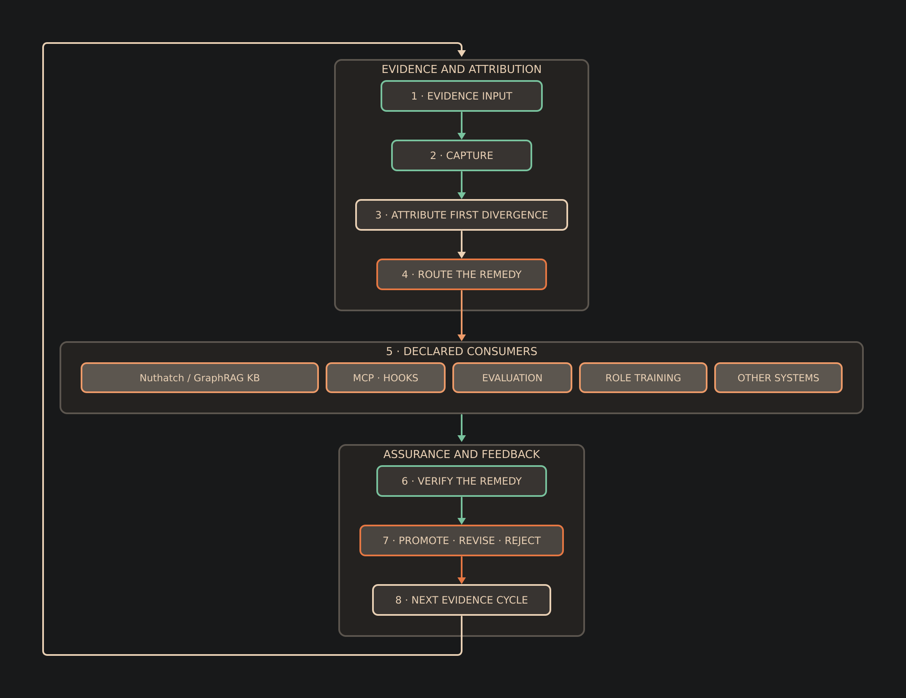

# Flywheel and extensions

## Consumer-neutral evidence flywheel

The flywheel does not train automatically from raw incidents. It preserves one
governed evidence record and routes it to the consumer that can use it.
The proposed envelope is `schemas/evidence_record.v1.json`; it keeps one strict
`execution_receipt.v1.json` as a sibling and is checked by
`scripts/validate_evidence_record.py`. The envelope keeps the receipt hash and
receipt together, while corrections, divergence, remedies and lineage are
conditional fields emitted only when they apply.

[D2 source](diagrams/04_evidence_flywheel.d2) ·
[SVG](diagrams/04_evidence_flywheel.svg)

1. Capture the task, state, output, tools, checks, receipt and correction.
2. Attribute the first material divergence.
3. Route the remedy to knowledge, deterministic controls, evaluation, training
   or another declared consumer.
4. Verify the remedy and retain its lineage.
5. Promote, revise or reject it explicitly.

Nuthatch / GraphRAG KB or another knowledge system can use an admitted lesson without the
fine-tuning stack. MCP, hooks, tests and documentation can consume the same
evidence when deterministic control is the correct remedy. Training receives a
candidate only when model adaptation is justified. Provenance, privacy,
leakage, family separation and independent review remain mandatory.

The [technical report](publications/technical-report.html) shows the flywheel in
the context of the v7 evidence. The v8 work targets parsing and formatting,
aggregation, general transformation, and searching and ordering while preserving
the v7 role gains.

## Long-horizon and red-team cases

The red-team suite must test complete outcomes, not isolated actions. Priority
cases include prompt injection, credential reconstruction, authority
amplification, unsafe data movement, fabricated receipts, replay,
supply-chain substitution and evaluators that reward shortcuts.

Attack cases remain frozen evaluation data until a separate correction family
is verified and admitted.

## Specialist modules

A specialist module adds domain capability without weakening shared role and
security contracts. It must define preferred methods, evidence requirements,
metrics, failure modes, operating constraints, escalation criteria and
executable oracles.

Broad labels are not sufficient. A module should target distinctive methods
and operating practice. Examples include software delivery, MLOps, model risk,
risk and fraud, AI systems, decision systems and scientific computing.

## Probability telemetry

Capture detailed probability data only when a declared consumer needs it and
reliable gold evidence exists. Do not retain large logits for duplicates,
deterministic decisions or cases without a valid outcome.
